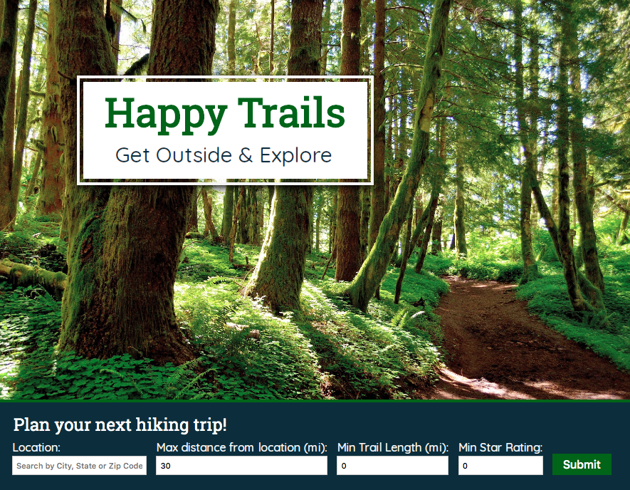
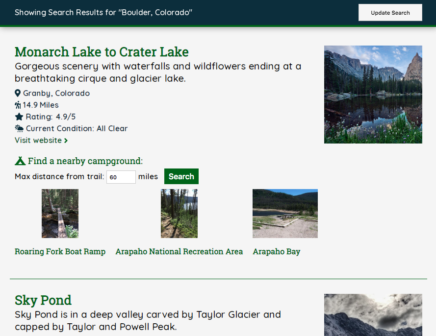

#Happy Trails
---
This app helps users plan a hiking trip by assisting in finding trails, nearby campgrounds, and current trail conditions near a specified location. 
## APIs Used
---
Hiking Project Data REI API and Open Geocoding MapQuest API
## Front-End
---
*HTML5
*CSS
*JavaScript
*jQuery

## Live Demo
---
[Link](https://sloach1218.github.io/hiking-app/)

## Screenshots
---
Landing Page:

Results Page:
